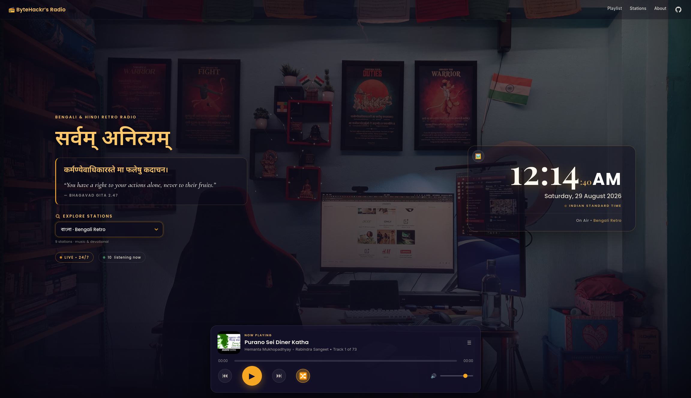

# ByteHackr’s Radio

[](https://github.com/ByteHackr/radio.bytehackr.in/actions/workflows/ci.yml)
[](https://radio.bytehackr.in)
[](LICENSE)

**सर्वम् अनित्यम्** — *all things pass, songs remain.*

A static internet-radio site at [radio.bytehackr.in](https://radio.bytehackr.in). Live FM plus Bengali and Hindi retro, English hits, and devotionals — including a 100-track Bhagavad Gita playlist. Playback uses the YouTube IFrame API behind a custom player. The hero photo and a Gita shloka change with each song. A live IST clock sits in the hero. Listener count comes from the free Abacus API, with a simulated fallback.

[](https://radio.bytehackr.in)

## Live

- Site: https://radio.bytehackr.in
- Source: https://github.com/ByteHackr/radio.bytehackr.in
- Pages: GitHub Pages from `main` (root), custom domain via `CNAME`

## Stations

| Key | Station | Tracks |
| --- | --- | ---: |
| `livebengali` | 🎙️ Live • বাংলা | FM Rainbow Kolkata, Maitree, Geetanjali, FM Gold Kolkata, Mixify, My 90s Bengali |
| `livehindi` | 🎙️ Live • हिन्दी | Radio Mirchi, Vividh Bharati, Fever 104, Ishq FM, FM Gold Delhi, Red FM |
| `liveenglish` | 🌍 Live • English | BBC World Service, Capital FM, Heart London, Classic FM |
| `bengali` | বাংলা • Bengali Retro | 73 |
| `hindi` | हिन्दी • Hindi Retro | 28 |
| `relax` | Relax Hits | 114 |
| `english` | English Hits | 100 |
| `durga` | 🌺 Durga | 38 |
| `hanuman` | 🚩 Hanuman | 7 |
| `shiva` | 🔱 Shiva | 50 |
| `ganesha` | 🪔 Ganesha | 5 |
| `gita` | 📖 Gita | 100 |

515 YouTube tracks in total, plus a handful of live FM streams. Broken or unembeddable videos are skipped at runtime.

## Live radio

The **Live radio** group plays real FM/internet streams (not YouTube). Each station has a known HTTPS stream URL so playback does not wait on the [Radio Browser](https://www.radio-browser.info/) API (that lookup is still used as a fallback and to count plays). HLS streams (All India Radio) use a local copy of [hls.js](https://github.com/video-dev/hls.js/) because desktop Chrome cannot play `.m3u8` natively. After a deploy, `index.html` cache-busts `script.js` and `style.css` so Cloudflare does not keep serving an old player.

Famous picks only:

- **Bengali** — FM Rainbow Kolkata, Akashvani Maitree, Akashvani Geetanjali, FM Gold Kolkata, Mixify Bengali Hits, My 90s Bengali
- **Hindi** — Radio Mirchi, Vividh Bharati, Fever 104 FM, Ishq FM, FM Gold Delhi, Red FM 93.5
- **English** — BBC World Service, Capital FM London, Heart London, Classic FM

Prev / next switches streams inside that live group. Seek and shuffle stay playlist-only. If the API is unreachable, each stream has a fallback URL in `LIVE_RADIOS` in `script.js`.

## Features

- Custom player: play / pause, next / previous, seek, volume, mute, shuffle
- Live FM via Radio Browser (Bengali, Hindi, English music + BBC World)
- Station picker (dropdown on desktop, chips on mobile) plus a playlist drawer
- Live IST clock with hours, minutes, small seconds, and AM/PM
- Rotating background photos and Bhagavad Gita shlokas
- Responsive layout for desktop, tablet, and phone
- No build step — HTML, CSS, and JS only

## Structure

```
index.html                 page structure, meta, Open Graph
style.css                  layout and theme
script.js                  stations, live radios, songs, backgrounds, shlokas, player
assets/                    background photos (must stay in sync with BACKGROUNDS)
docs/desktop.png           desktop homepage screenshot for the README
CNAME                      custom domain radio.bytehackr.in
.nojekyll                  skip Jekyll on GitHub Pages
scripts/ci-check.mjs           integrity tests for CI
scripts/add-tracks.sh          add a YouTube video or playlist to a station
scripts/add-tracks.mjs         implementation for add-tracks.sh
scripts/add-tracks.test.mjs    tests for the add-tracks helper
vendor/hls.min.js              HLS playback for live AIR streams (Chrome)
.github/workflows/ci.yml   GitHub Actions pipeline
LICENSE                    MIT
```

## Run locally

```bash
python3 -m http.server 8000
# open http://localhost:8000
```

Or `npm start` (same command).

## Tests / CI

```bash
npm test
```

That syntax-checks the JS files, runs `scripts/ci-check.mjs`, and runs `scripts/add-tracks.test.mjs`. Integrity checks verify:

- required files (including `scripts/add-tracks.sh`), CNAME, title, and Open Graph tags
- every YouTube and live-radio key has a matching `<option>` and station chip
- every YouTube id is 11 characters; every live stream has a Radio Browser UUID
- every YouTube station has at least one song
- `BACKGROUNDS` matches the image files in `assets/`
- DOM ids used in `script.js` exist in `index.html`
- README documents `add-tracks.sh` and live radio

Add-tracks tests cover `--help`, `--list`, the `./scripts/add-tracks.sh` wrapper, error cases (unknown station, `--new` without `--label`, non-YouTube URL), URL parsing, `--dry-run` (no writes), adding a video to an existing station with `--offline`, skipping duplicates, and `--new` writing both `script.js` and `index.html`. Those write tests copy files into a temp directory (`RADIO_ROOT`) so the repo itself is not modified, and they never call YouTube.

GitHub Actions runs the same checks on every push and pull request to `main`, then fetches `/`, `style.css`, and `script.js` from a local static server.

Deploy stays on **GitHub Pages → Deploy from a branch → `main` / (root)**. The CI workflow does not publish the site; a failing check should be fixed before you rely on a new Pages build.

## Add songs or a station

Use `./scripts/add-tracks.sh` (or `npm run add -- …`). Pass a YouTube **video** or **playlist** URL. A watch URL adds one song. A playlist URL adds every video. Duplicate ids already on that station are skipped.

```bash
./scripts/add-tracks.sh --help
./scripts/add-tracks.sh --list

# existing station — one video
./scripts/add-tracks.sh bengali 'https://youtu.be/XXXXXXXXXXX'

# existing station — whole playlist
./scripts/add-tracks.sh relax 'https://www.youtube.com/playlist?list=PLxxxx'

# new station (also updates index.html: dropdown option + mobile pill)
./scripts/add-tracks.sh --new lofi --label "Lofi Beats" --emoji 🌙 \
  --group music \
  'https://www.youtube.com/playlist?list=PLxxxx'

# preview only
./scripts/add-tracks.sh --dry-run ganesha 'https://youtu.be/XXXXXXXXXXX'
```

Same commands via npm: `npm run add -- --list` and `npm run add -- bengali 'https://youtu.be/XXXXXXXXXXX'`.

| Flag | What it does |
| --- | --- |
| `--list` | Print station keys and track counts |
| `--station KEY` / first argument | Existing station (`bengali`, `gita`, …) |
| `--new KEY` | Create a station (`lowercase` letters/digits) |
| `--label TEXT` | Display name (required with `--new`) |
| `--emoji 🌙` | Prefix on the new station chip |
| `--group music` or `devotional` | Which dropdown `<optgroup>` (default: music) |
| `--playlist` / `--video` | Force playlist vs single video when the URL has both |
| `--title` `--artist` `--year` | Override metadata for a single song |
| `--limit N` | Cap how many playlist items to import |
| `--force` | Add even if the id is already on the station |
| `--dry-run` | Print the plan; do not write files |
| `--offline` | Use the video id only (no yt-dlp / YouTube). For tests or when you already know the id. |

Needs **Node 18+**. Install [yt-dlp](https://github.com/yt-dlp/yt-dlp) for complete playlists (`sudo dnf install yt-dlp` on Fedora). Without yt-dlp, a playlist still imports from YouTube’s public API but later pages may be missing.

`npm test` includes `scripts/add-tracks.test.mjs` so these paths stay covered in CI.

You can still edit `script.js` by hand:

```js
{ id: "XXXXXXXXXXX", title: "Song", artist: "Artist", year: "Film • Year" }
```

`id` is the 11-character id from any `youtube.com/watch?v=XXXXXXXXXXX` URL. Prefer official label uploads (Saregama, Sony Music India, T-Series, Coke Studio) so embedding is allowed.

To add a station by hand: add a key to `STATIONS`, an `<option>` in `#stationSelect`, and a matching `.station-pill`. Playlist tabs pick up new keys automatically. `npm test` fails until those three lists stay in sync.

## Add backgrounds

Drop the image in `assets/` and add its path to the `BACKGROUNDS` array in `script.js`. Keep that array in sync with the files that are actually in `assets/`. Landscape, ≤ 500 KB recommended.

Current photos:

```
assets/IMG_20200415_212350.jpg
assets/IMG20241101171750.jpg
```

## Add shlokas

Add an entry to the `SHLOKAS` array in `script.js`:

```js
{ sa: "संस्कृत श्लोक", en: "English translation.", ref: "Bhagavad Gita X.X" }
```

## Customise

| What | Where |
| --- | --- |
| Header name | `.logo` in `index.html` |
| Page title / social preview | `<title>` and Open Graph tags in `index.html` |
| GitHub links | two spots in `index.html` marked `<!-- update this URL -->` |
| Colours | CSS variables at the top of `style.css` |
| Clock size | `.clock-time` · seconds `.clock-seconds` · AM/PM `.clock-ampm` |
| Player size | `.player` |
| Listener counter | namespace / fallback range at the bottom of `script.js` |

## Deploy on GitHub Pages

1. Push to GitHub (`main`).
2. Repo → **Settings → Pages → Deploy from a branch → main / (root) → Save**.
3. Default URL: `https://<your-username>.github.io/<repo-name>/`.
4. For `radio.bytehackr.in`: keep the `CNAME` file, point a DNS `CNAME` for `radio` at `<your-username>.github.io`, then set the custom domain under **Settings → Pages**.

## License

MIT. See [LICENSE](LICENSE). Audio streams from YouTube and remains subject to YouTube’s terms; this repo only stores video ids and UI code.
